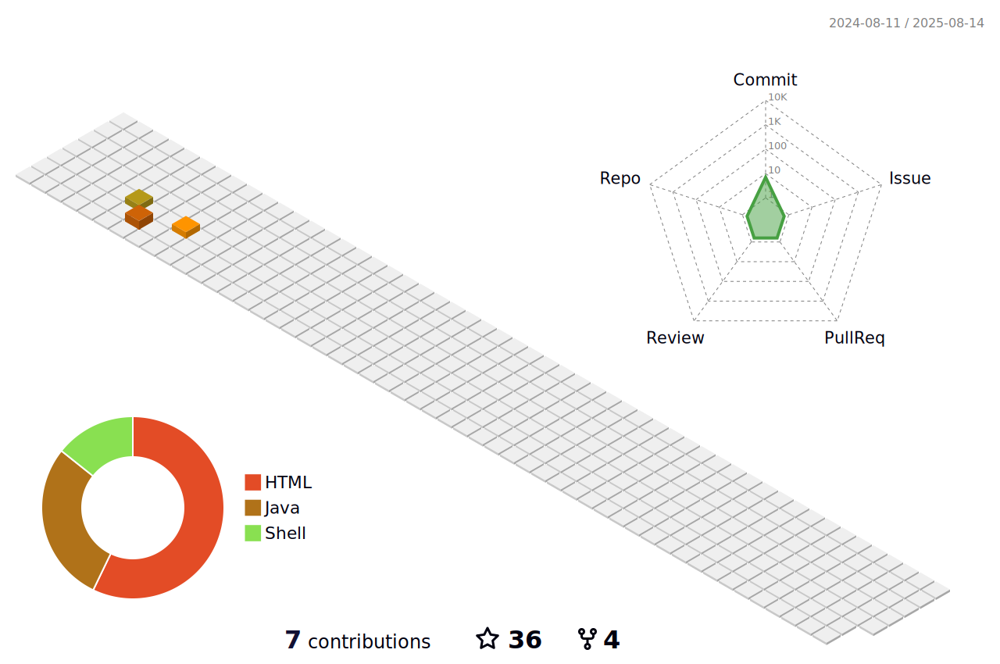

### Hi there👋



## Welcome to zzziCode's repository! 🎉🎉🎉

<!---->
<!---->

- 🏫 Studing at @<a href="http://www.hrbeu.edu.cn/" target="_blank">HEU</a>
- 🏡 Living at @[HaErBin](https://zh.wikipedia.org/wiki/%E5%93%88%E5%B0%94%E6%BB%A8%E5%B8%82)
- 🌱 Blog at@[zzzi的小站](https://zzzicode.github.io/)
- 🧐 Try to find a good job
- 🤔 論文を出版したい
  
  
  

```javascript
// Which came first: the chicken or the egg?
console.log(['🥚', '🐣', '🐥', '🐔'].sort())

>>> [ '🐔', '🥚', '🐣', '🐥' ]
```
